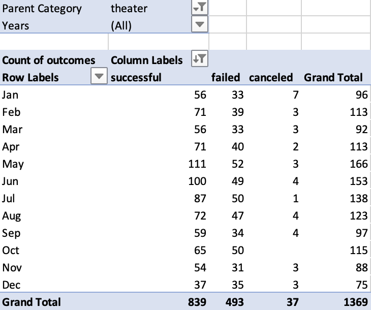

# Kickstarting with Excel

## Overview of Project

### Background
Microsoft Excel is a simple, yet powerful tool for cleaning, organizing, and analyzing large datasets. In this mini-project, I took a sample dataset and applied concepts like filters, pivot tables, and measures of central tendency to discover complex relationships.

### Purpose
I was tasked with helping a playwright launch a crowdfunding campaign for her new play by organizing and analyzing raw Kickstarter data containing funding goals, pledge amounts, launch dates, project category, and other information. She needed to raise at least $10,000, and she needed my help to find factors that might improve her chance of success.

## Analysis and Challenges

### Reformatting to Suite Client Needs
By observing the months in which successful Kickstarter campaigns began, the playwright might stand a greater chance of meeting her crowdfunding goal. To do this, there were a few initial steps I needed to take to refine the raw data for comparison. The first step was to separate the single category and subcategory column into two. I did this by breaking up the **Category and Subcategory** column by the "/" delimitor separating each value using Excel's *Convert Text to Columns Wizard*. Next, I needed to convert the integer (Unix) data in the **Launched_at** column into a more digestable format. This was done with the function below,
```
=(((J2/60)/60)/24)+DATE(1970,1,1)
``` 
 which converts an integer, or time elapsed since midnight of January 1, 1970 in seconds, to the *mm/dd/yyyy* format in a **Date Created Conversion** column. Finally, I used the YEAR() formula to grab only the year from the formatted date and place it into a **Years** column.

 Additionally, by comparing previous campaign success rates to their fundraising goals (in dollar amount), the playwright could gain insight on whether or not her goal of $10,000 fairs well for her chance at success. I will speak to what data I pulled from the Kickstarter dataset later in the **Analysis of Outcomes Based on Goals** section, but I used the following function to import filtered data into a new sheet to isolate the process:
```
=COUNTIFS(Kickstarter!D:D, "<1000", Kickstarter!F:F, "successful", Kickstarter!R:R, "plays")
```
This example pulls an integer value representing the number of successful plays there were that had a fundraising goal less than $1000.

### Analysis of Outcomes Based on Launch Date
After initializing the dataset, I created a pivot table to focus on important data for the playwright's campaign. By grouping theater fundraising outcomes by the month they were launched in, I was able to observe the success rate of the relavent campaigns in the context of timing. This visulization could help the playwright figure out which months of the year would maximize her likelihood for reaching her $10,000 goal. By importing the **Parent Category** and **Years** columns into the *Filters* field, the **Outcomes** column in to the *Columns* field, the **Date Created Conversion** column into the *Rows* field, and the **Outcomes** column in the *Values* field, Table 1 (below) was created.



I then created the chart below using Excel's *Pivot Chart* tool. 


### Analysis of Outcomes Based on Goals
By grouping the number of each fundraising outcome within a range of goal amounts, the playwright could gain a etter understanding of whether she needs to reconsider her current budget before starting her campaign. After creating a new sheet and using the COUNTIF() formula to count each play fundraiser outcome within varying goal ranges, I calulated the percentage of the total number of play campaigns for each goal range that were successful, failed, or were canceled in three new columns. I then plotted these three columns aginst the goal ranges:


I also noticed that, given that no plays were canceled, the canceled line remains at 0% for each goal range. This is not necessarily a problem in my case, but if significantly more plays *were* canceled, the chart would be a lot less helpful for our dear playwright. Failure means that a goal was not hit, and success means the goal was hit. However, cancellation does not necessarily mean that the reason for ceasing the campaign was financial... Fortunately our data did not have this problem, or else a deeper investigation would have been necessary.


### Challenges and Difficulties Encountered
One issue I came across when creating Table 1 was that I had a row and column each marked "[blank]" when the Kickstarter data was first imported into the pivot table sheet. Adding the dropdown filters thankfully allowed easy removal of these irrelevant groups. I also noticed that, given no plays were canceled, the percentage canceled line remains at zero for each goal range. This is not necessarily a problem in my case, but if significantly more plays *were* canceled, the chart would be a lot less helpful for our dear playwright. Failure means that a goal was not hit, and success means the goal was hit. However, cancellation does not necessarily mean that the reason for ceasing the campaign was financial... Fortunately our data did not have this problem, or else a deeper investigation would have been necessary.

## Results

### Outcomes vs. Launch Month Conclusions
- The best months for the playwright to launch her campaign are May, June, and July - based on the vertical distance of each month's "successful" datapoint from its corresonding "failed" point.
- Based on the same tactic, the worst months to launch would be October and December.

### Outcomes Based on Goals Conclusion
- The highest percentage of successful plays spent between $25,000 to $34,999 and $45,000+, with the most successful range being $45,000 to $49,999. The playwright should consider raising more than $10,000 to ensure a higher likelihood of success.

### Limitations of the Dataset
- The data does not include production revenue. This could help her optimize fundraising amount for profit, if she's into that.
- Average age of backers or any info about backers would be extremely helpful for how she chooses to plug and advertise the campaign on social media or locally.

### Other Possible Tables and Graphs
- Outcome Percentages vs. Length of Campaign to see if length of time affects success rate.
- Pledged/Goal Ratio vs. Parent Category or Subcategory could give some info on viewer demand.
